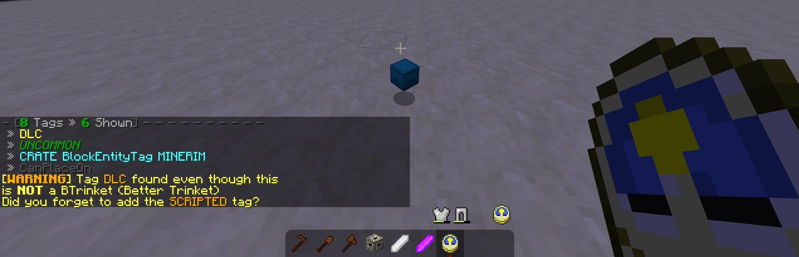

# Scripts for the Minecraft [CustomNpcs](https://www.curseforge.com/minecraft/mc-mods/custom-npcs) Mod
Advanced Scripts for Audio / Utilities / Trinkets / CombatCircle &amp; more

**[MIT LICENSE]** - Credit is _appreciated_ but not _required!_

* Want to see all of these scripts in action? Check out [METAL WEAPON: RE:COIL](https://www.planetminecraft.com/project/metal-weapon-3-re-coil/)

## Table of Contents
1. [Guide](#user-content-guide-how-to-load-scripts): How to Load Scripts?
### Audio
2. [**JTunes**](#user-content-jtunes) - Fully Fledged Background music using AudioJ2CK
3. [**AudioJ2CK**](#user-content-audioj2ck) - 2D Audio / No Input Lag
### Spawnpoints
4. [**HyperSpawnpoint12**](#user-content-hyperspawnpoint12) - Better Spawnpoints w/ Optional Spectator Mechanic
5. [**HyperMobSpawner12**](#user-content-hypermobspawner12) - Soulslike Enemy Respawning
### Items
6. [**DigitalTrinkets12**](#user-content-digitaltrinkets12) - "Digitize" items into copyable strings & vice versa
7. [**BItemRenamer**](#user-content-bitemrenamer) - Multi-Tool to Copy/Clone/Paste/Rename/Color/Tag any Item
8. [**BTagLister**](#user-content-btaglister) - Tool for Viewing Item NBT tags
### Utilities
9. [**ACInstaller**](#user-content-acinstaller) - Adventure Map automatically installs map content/resources/skins/sounds
10. [**FUtil**](#user-content-futil) - File System Editing
11. [**StandardUtil12**](#user-content-standardutil12) - Vector Math at Your Fingertips
12. [Legacy 1.7.10 Ports](#user-content-documentation-1710)

## Guide: How to Load Scripts?
1. Place all scripts you want to use in the `<world>/customnpcs/scripts/ecmascript/` folder.
2. In Minecraft, Right-Click NPC/Block with the npcScripter
3. Select the "Load Scripts" button.
4. Click the Arrow `>` to load the script.
* Now paste the following code on your npc:
```js
// Load StandardUtil12 Example

function init(e){
  Utilities.Broadcast("&4I loaded my first script!");
}
```

## JTunes
### JTunes
A fully fleshed out audio system utilizing the power of AudioJ2CK for 1.12.2+ Play seamless background/boss music, *anytime, anywhere!*

### Setup
Place WAV files in `<.minecraft or SERVER_Root>/customnpcs/assets/customnpcs/sounds/audiojack`
1. Load AudioJ2CK and JTunes in playerscript
2. Call `JTunes.Login(e);` and `JTunes.Tick(e);` - in player login/tick respectively
3. Edit Songs/Triggers in JTunes.js

### Boss Music

Start / Stop Boss music using world Tempdata. NOTE: Starting boss music automatically stops the background music and resumes it after you stop the boss music
```js
world.getTempdata().put("JBOSS", "my_song_name");
world.getTempdata().put("JBOSS", null);
```

## AudioJ2CK
### AudioJ2CK
Place WAV files in `<.minecraft or SERVER_Root>/customnpcs/assets/customnpcs/sounds/audiojack`

1. Load script anywhere (npc, block, or player)
2. Call `Audio.Logout(e);` inside your playerscript logout event.  
3. Call any of the below:  

```js
Audio.Play("wavFileName");
Audio.Play("wavFileName", audioGain);
Audio.Loop("wavFileName");
Audio.Loop("wavFileName", audioGain);
Audio.Stop("wavFileName");
Audio.StopAll();
Audio.IsPlaying("wavFileName");
```
## HyperSpawnpoint12
### HyperSpawnpoint12
Location-Based Spawnpoints with an optional Spectator Mechanic (for Singleplayer or Multiplayer)

Requires:
* [**HyperSpawnpoint12.js**](https://github.com/H4CKR3M/CustomNpcs-Scripts/blob/main/HyperSpawnpoint12.js)
* [**HSpawnpointPlayer.js**](https://github.com/H4CKR3M/CustomNpcs-Scripts/blob/main/HSpawnpointPlayer.js)
* [**HSpawnpointOrigin.js**](https://github.com/H4CKR3M/CustomNpcs-Scripts/blob/main/HSpawnpointOrigin.js)

### 1. Basic Setup

1. First we'll need to modify the playerscript. Open the playerscript (npc scripted right-click the air).
2. Load `HyperSpawnpoint12.js` and `HSpawnpointPlayer.js` in the playerscript.
3. Paste the following:
```js
// Requires: HSpawnpointPlayer, HyperSpawnpoint12

function login(e){
    HSpawnpointPlayer.Login(e);
}

function logout(e){
    HSpawnpointPlayer.Logout(e);
}
```

4. Next, Place a Scripted Block at the World Origin `/setworldspawn` I like to make this a black box that the player starts in. Don't forget to type `/gamerule spawnRadius 0` in-game.
5. Load `HyperSpawnpoint12.js` and `HSpawnpointOrigin.js` on the block.
6. Paste the following:
```js
// Requires: HSpawnpointOrigin, HyperSpawnpoint12

function tick(e){
    HSpawnpointOrigin.Tick(e);
}
```

7. Next, let's make our first spawnpoint! First, place down another scripted block far away from the World Origin.
8. Load `HyperSpawnpoint12.js` on the second block.
9. Paste the following:
```js
/* Basic Spawnpoint | ScriptedBlock | Verified 1.12.2+ (1.12.2, 1.16.5)
 * Requires: HyperSpawnpoint12
 */

var spawnpoint;

function init(e){
    spawnpoint = HyperSpawn.hyperSpawnpoint;
    spawnpoint.pos = { x:e.block.x+0.5, y:e.block.y+2, z:e.block.z+0.5};
    spawnpoint.block = e.block;
    spawnpoint.world = e.block.world;
}

function tick(e){
    spawnpoint.SaveNearbyPlayers();
}
```

10. The default location the player is sent to if they have **NOT** touched a spawnpoint can be set in `HyperSpawnpoint12.js` at the top of the file. It's labeled: `defaultStart: { x:-79.5, y:90.5, z:93.5 }`
* You can also tweak the default spawnpoint range in `HyperSpawnpoint12.js`

### 2. Advanced Setup

So you have your spawnpoints working, but you want more control over player rotation, yaw, etc... Well, you're in luck! Each spawnpoint can be tweaked individually. Let's what a more advanced version of your spawnpoint code *(See [1. Basic Setup, Step 9.](#user-content-1-basic-setup)).* might look like:
```js
/* Advanced Spawnpoint | ScriptedBlock | Verified 1.12.2+ (1.12.2, 1.16.5)
 * Requires: HyperSpawnpoint12
 */

var spawnpoint;

function init(e){
    spawnpoint = HyperSpawn.hyperSpawnpoint;
    spawnpoint.pos = { x:e.block.x+0.5, y:e.block.y+2, z:e.block.z+0.5};
    spawnpoint.yaw = 180;
    spawnpoint.pitch = 0;
    spawnpoint.range = 5;
    spawnpoint.block = e.block;
    spawnpoint.world = e.block.world;
    e.block.model = "minecraft:sea_lantern";
}

function tick(e){
    spawnpoint.SaveNearbyPlayers();
}
```

### 3. Enabling/Disabling Spectator Mode [Advanced]

On multiplayer, if **player1** is killed, they will be switched to spectator mode. Only after **player2** reaches a new spawnpoint, will **player1** be revived. This behavior can be toggled ON/OFF.

* To **ENABLE** the spectator mechanic, open `HyperSpawnpoint12.js` and change `ID:` to anything. For example: `ID: "ID"` would be fine, or `ID: "world1"` etc...
* To **DISABLE** the spectator mechanic, open `HyperSpawnpoint12.js` and change set ID to none `ID: "none"`

But what does setting the `ID` actually do? Well, setting it to `"none"` completely disables the spectator mechanic. Players will respawn instantly when they are killed. Setting the `ID` to something else will assign that spawnpoint to a group. All players interacting with spawnpoints of the same `ID` will respawn when touching other spawnpoints of the same group. If you're unsure what `ID` to use, and you still want to use the spectator mechanic, just set the `ID` to ID in `HyperSpawnpoint12.js`. Like this: `ID: "ID"`

### 4. ACInstaller Support [Advanced]

You can modify the spawnpoint origin code *(See [HyperSpawnpoint12, 1. Basic Setup](#user-content-1-basic-setup))* to teleport the player out of the world spawn only after installing skins/textures/sounds to the player's world. The below code can be used to achieve this. Don't forget to load `FUtil`, `ACInstaller`, `HSpawnpointOrigin`, `HyperSpawnpoint12`
* *Remember! We're pasting this script on the scripted block at the World Origin `/setworldspawn`*
```js
// Requires: FUtil, ACInstaller, HSpawnpointOrigin, HyperSpawnpoint12

var counter = 0;
var needsRestart = false;
var waitTime = 5;

function tick(e){
    if (needsRestart){
        if (counter % 5 == 0)
            ACI.Say("§6YOU MUST FULLY §f§lRESTART MINECRAFT§6 TO FINISH!");
        counter++;
        return;
    }
    else if (ACI.IsInstalled()){
        HSpawnpointOrigin.Tick(e);
        return;
    }

    if (counter >= waitTime){
        if (counter == waitTime){
            ACI.Install();
            if (!FUtil.IsDedicatedServer())
                needsRestart = true;
        }
    }
    counter++;
}
```

### 5. ACInstaller Support with DLOAD [Very Advanced]

If you're feeling up to it, the origin code can be modified a third time to support DLOAD (a DLC Installer/Loader for Minecraft Maps). I won't go too far into the details here, suffice it to say the code waits for DLOAD to finish installing any DLC the player might need, before warping the player out of the world origin. Don't forget to load `FUtil`, `ACInstaller`, `HSpawnpointOrigin`, `HyperSpawnpoint12`

```js
// Requires: FUtil, ACInstaller, HSpawnpointOrigin, HyperSpawnpoint12

var counter = 0;
var needsRestart = false;
var waitTime = 5;
var loadCompleteKey = "DLOAD_COMPLETE";

function tick(e){
    if (needsRestart){
        if (counter % 5 == 0)
            ACI.Say("§6YOU MUST FULLY §f§lRESTART MINECRAFT§6 TO FINISH!");
        counter++;
        return;
    }
    else if (ACI.IsInstalled()){
        HSpawnpointOrigin.Tick(e);
        return;
    }

    // WAIT for Dload to finish
    if (e.block.world.getTempdata().has(loadCompleteKey) && e.block.world.getTempdata().get(loadCompleteKey) == true){
        if (counter >= waitTime){
            if (counter == waitTime){
                ACI.Install();
                if (!FUtil.IsDedicatedServer())
                    needsRestart = true;
            }
        }
        counter++;
    }
}
```

## HyperMobSpawner12
### HyperMobSpawner12
An easy to use despawning/respawning system for enemies! Here's how it works, if the player dies, all enemies are despawned/respawned **lag-free**!

Requires:
* [**HyperMobSpawner12.js**](https://github.com/H4CKR3M/CustomNpcs-Scripts/blob/main/HyperMobSpawner12.js)
* Requires the use of HyperSpawnpoint12 *(See [HyperSpawnpoint12, 1. Basic Setup](#user-content-1-basic-setup))*

### Example
1. Save an npc named **npc1** and an npc named **npc2** to tab 1 in the mob cloner (Server)
2. Place down a scripted block (this will be our mob spawner)
3. Load `HyperMobSpawner12` on the block.
4. Paste the following:
```js
/* v2.0 - HMobSpawner | ScriptedBlock | Verified 1.12.2+ (1.12.2, 1.16.5)
 * Requires: HyperMobSpawner12
 */

function init(e){
    HyperMobSpawn.pos = { x:e.block.x, y:e.block.y+2, z:e.block.z};
    HyperMobSpawn.ID = "UniqueID";
    HyperMobSpawn.range = 10;
    
    HyperMobSpawn.clones = [
        { x:130.5, y:75, z:100.5, prefab: "clone1" },
        { x:140.5, y:75, z:100.5, prefab: "clone2" },
        ];
}

function tick(e){
    HyperMobSpawn.Tick(e);
}
```

5. See the `HyperMobSpawn.ID` parameter? Every mobSpawner needs a unique ID, don't forget!

### <span style="color:#BF3427">MobSpawners will only despawn/respawn mobs when the player enters the world spawn - **AKA: <u>Make sure to set up HyperSpawnpoint12 correctly!**</u></span>

* You can place as many spawners as you want in the world, just give each of them a unique `HyperMobSpawn.ID` Otherwise...
* Spawners with the same `HyperMobSpawn.ID` will be treated as the same spawner.
* Spawners also have a `HyperMobSpawn.hyperSpawnpointID`. This should be the same as the ID written in `HyperSpawnpoint12.js`

You can change the clone tab *(default is 1)* in `HyperMobSpawner12.js` under `mobSummonTab`

### Saving Mob Positions in Bulk
I know what you're thinking, isn't it a pain in the rear to write down the coordinates for every single mob? **Yes, it is.** Thankfully, we have a tool for that! *Drum roll please* Introducing the `PositionSaver` tool. *Not a very catchy name...*

* **Tools/PositionSaver.js**

Setup:
1. Load `PositionSaver.js` on a scripted item - <u>*or copy the code to a scripted item.*</u>
* NPC positions & clone name are saved to your minecraft world directory. From there you can open the txt file and copy the mob positions to your mob spawner. Magic!

<br />
<div align="left">
  
</div>

## DigitalTrinkets12

Library for converting items to *digital strings* and vice-versa.

Requires: `StandardUtil12`

```js
/* Converts trinket to string format, saves to tempdata & worlddata */
DigitalTrinkets12.Digitize(itemStack);
DigitalTrinkets12.DigitizeDebug(itemStack, key, bDebug);

/* Gives the given digital trinket to given player */
DigitalTrinkets12.Give(player, digitizedString);
DigitalTrinkets12.Replace(player, digitizedString, slotID, slotCategory);
DigitalTrinkets12.GiveShulker(player, digitalShulker);
DigitalTrinkets12.Summon(x, y, z, world, digitizedString);

/* Returns digitizedString - Modifies an Attribute ('attackDamage') */
DigitalTrinkets12.SetAttribute(digitizedString, attributeName, num);

/* Returns FLOAT - Gets attribute written in item lore (if it exists). */
DigitalTrinkets12.GetLoreAttribute(digitizedString, attributeName);

/* Delimiting */
DigitalTrinkets12.GetDelimiter();
DigitalTrinkets12.GetDataKey();
```

### Example: Giving *Digitized-Item* to Player.

```js
// Paste script on Player. Requires: DigitalTrinkets12, StandardUtil12

function init(e){
    DigitalTrinkets12.Give(e.player, "Moss Stone@0minecraft:mossy_cobblestone");
}
```

### How does the format work?

The digital trinkets format is an intermediary format for storing items in convenient strings, for use spawning them-in later. How the items are stored isn't too important. Suffice it to say, Digital Trinkets uses a list delimited by the `@` symbol and a code character following it *(EX: `@0` is code for MC ID)*. Rather than create or edit items in this format, it is recommended to make an item normally using `/give` commands or using the `BItemRenamer`, then use the `BItemRenamer` to "*Digitize*" the item into the digital trinkets format.

## BItemRenamer
Advanced Multi-tool for item-editing entirely in-game.

Requires:
* [**StandardUtil12.js**](https://github.com/H4CKR3M/CustomNpcs-Scripts/blob/main/StandardUtil12.js)
* [**DigitalTrinkets12.js**](https://github.com/H4CKR3M/CustomNpcs-Scripts/blob/main/DigitalTrinkets12.js)

### Quickstart Guide

1. Paste the following code on a customnpcs `scripteditem` and load the `Tools/BItemRenamer.js` script.
2. Left-Click to Change Modes.
    * **<span style="color:#55FF55">Item Renamer</span>** - Rename Offhand Item
    * **<span style="color:#AAAAAA">Lore Applicator</span>** - Renames Offhand item from clipboard
    * **<span style="color:#00AAAA">Digitizer</span>** - Copy item to clipboard
    * **<span style="color:#AA00AA">Full Inventory Digitizer</span>** - Copy all items from inventory to notepad
    * **<span style="color:#FFAA00">New Trinket Creator</span>** - Creates a brand new item
    * **<span style="color:#FF5555">Create Trinket From </span><span style="color:#00AAAA">Digitized</span>** - Creates a brand new item from clipboard
3. Right-Click to Activate.

```js
/* Better Item Renamer  -  Right-Click Use, Left-Click Change Mode */
var config = {
    version: 4,
    name: "&3&lCool Sword",
    lore: [
        "&7The first lore line in gray",
        "&6Another lore line in gold!",
    ],
    /* Create New */
    ID: "minecraft:iron_sword", dmgValue: 0, unbreakable: true,
    skull: "",
    rarity: '', // C U R L E
    slot: '',  // O M
    attributeLore: [],
    attributesEnabled: true,
    attributes: [
        { Slot: "mainhand", Amount: -2.4, Name: "attackSpeed" },
        { Slot: "mainhand", Amount: 8, Name: "attackDamage" },
    ],
    enchantments: { enabled: false, hide: true, list: [
            { ID: 10, Lvl: 1 }, 
    ] },
    hideFlagOverride: -1,
    tag: "", tagGroupID: "", tagItemType: "", scripted: false, tagsBonus: [], 
    

    /* Paste Digitized Trinket here to create it using CreateFromDigitized */
    digitizedTrinketOverride: "",
}
```

### The Different Modes (In-More-Detail)

#### (1/6) **<span style="color:#55FF55">Item Renamer</span>**

Renames/relores the offhand item. In this case, only the `name` and `lore` attributes from the config are in use:

```js
name: "&3&lCool Sword",
lore: [
    "&7The first lore line in gray",
    "&6Another lore line in gold!",
],
```
#### (2/6) **<span style="color:#AAAAAA">Lore Applicator</span>**

The Lore Applicator is used to apply name/lore from items copied to the `clipboard`. In this case, the *clipboard* refers to anything copied using the Item Renamer's **<span style="color:#00AAAA">Digitizer</span>** mode.

#### (3/6) **<span style="color:#00AAAA">Digitizer</span>**

Copies the name/lore of the offhand item to the `clipboard`, allowing easy transfer of name/lore from `Item_A` to `Item_B`.

* In addition, the Digitizer stores a copy of the item's **FULL** Digitized NBT in `<world_name>\customnpcs\scripts\world_data.json`

```json
{
    "Rimscar": "ice,102,64,1045",
    "DIGITIZE": " §b§l§3§lCool Sword@0minecraft:iron_sword@1§7The first lore line in gray@1§6Another lore line in gold!@3-2.4$mainhand$generic.attackSpeed$6306967376447754078L$-7033089619897944626L@38.0$mainhand$generic.attackDamage$9014307011666463470L$-7590962855292505164L@57@71",
}
```
#### (4/6) **<span style="color:#AA00AA">Full Inventory Digitizer</span>**

This mode digitizes all inventory items and saves them to `world_data.json` where they can be copied using external programs.

<details>
<summary>Click to expand</summary>

```json
{
    "DIGITIZE11": "§e[§6§lDLC§e] §4Artifact Box@0minecraft:red_shulker_box@1§2§o* Uncommon §e[Crate]@1§7@1 §cThe strange warmth radiating from@1 §cthis box is only alluded to after@1 §cwitnessing the soot and ashes of@1 §cseveral dozen small hand prints@1 §caround the locking mechanism.@2AOO@2CRATE@2UNCOMMON@2DLC@532@8minecraft:sticky_piston",
    "DIGITIZE9": "§e[§6§lDLC§e] §b§lARC SUIT@0minecraft:light_blue_shulker_box@1§6§l§o* Legendary §e[Crate]@1§7@1 §3Final model designed by@1 §3ARC Integrated Systems.@1 §3For the few who braved@1 §b§n§lMETAL WEAPON II@2METALWEAPON2@2CRATE@2DLC@2LEGENDARY@532@8minecraft:sticky_piston",
    "DIGITIZE10": "§e[§6§lDLC§e] §f§lEETC Supply@0minecraft:yellow_shulker_box@1§2§o* Uncommon §e[Crate]@1§7@1 §fShipping crate that must have@1 §ffallen off of a merchant vessel@1 §fand drifted to shore. The EETC @1 §finsignia is carved into the side.@2CRATE@2UNCOMMON@2DLC@2COMPANY@532@8minecraft:sticky_piston",
    "DIGITIZE32": "Moss Stone@0minecraft:mossy_cobblestone",
    "DIGITIZE": " §b§l§3§lCool Sword@0minecraft:iron_sword@1§7The first lore line in gray@1§6Another lore line in gold!@3-2.4$mainhand$generic.attackSpeed$6306967376447754078L$-7033089619897944626L@38.0$mainhand$generic.attackDamage$9014307011666463470L$-7590962855292505164L@57@71",
    "DIGITIZE12": "§e[§6§lDLC§e] §3Dawnguard Supplies@0minecraft:cyan_shulker_box@1§2§o* Uncommon §e[Crate]@1§7@1 §3Dawnguard starting supplies@1 §3given to players of Minerim.@2CRATE@2UNCOMMON@2DLC@2MINERIM@532@8minecraft:sticky_piston",
    "Rimscar": "ice,102,64,1045",
    "DIGITIZE40": " §b§l§3§lCool Sword@0minecraft:iron_sword@1§7The first lore line in gray@1§6Another lore line in gold!@3-2.4$mainhand$generic.attackSpeed$6306967376447754078L$-7033089619897944626L@38.0$mainhand$generic.attackDamage$9014307011666463470L$-7590962855292505164L@57@71",
    "DIGITIZE28": "Iron Leggings@0minecraft:iron_leggings@694",
    "DIGITIZE27": "§3[§b§lARC§3] §bSuit §lARMOR@0minecraft:iron_chestplate@1@1 §3 Reinforced armor protects@1 §3 against 90% more shrapnel.@1@694",
}
```

</details>


#### (5/6) **<span style="color:#FFAA00">New Trinket Creator</span>** - Creates a brand new item

Create a brand new item from the values saved in the scripteditem BItemRenamer config.

* These items may very in complexity:

<details>
<summary>Click to expand</summary>

<br>
<div align="left">
  </img>
</div>
<br />

```js
/* v2.2 - Better Item Renamer  -  Right-Click Use, Left-Click Change Mode */
var config = {
    name: " &c█  &4&lSUPPLEMENT&4 &l101&c  &c█",
    lore: [
" &c███&4╗  &l    &c███&4╗ &c████████&4╗ &c██&4╗      ",
" &c████&4╗&l  &c████&4║ ╚══&c██&4╔══╝ &c██&4║      ",
" &c██&4╔&c████&4╔&c██&4║    &l   &c██&4║    &l   &c██&4║      ",
" &c██&4║╚&c&l██&4╔╝&c██&4║    &l   &c██&4║    &l   &c██&4║      ",
" &c██&4║&l  &4╚&l═&4╝ &l &c██&4║    &l   &c██&4║    &l   &c███████&4╗",
" &4╚═╝         &l  &4╚═╝    &l   &4╚═╝    &l   &4╚══════╝ ",
                            
" &c██&4╗&c        &l &c██&4╗ &c██████&4╗  &l &c███&4╗     &l  &c██&4╗ ",
" &c██&4║&c        &l &c██&4║ &c██&4╔══&c██&4╗ &c████&4╗    &l &c██&4║ ",
" &c██&4║&c&l  &c█&4╗&l  &c██&4║ &c██████&4╔╝ &c██&4╔&c██&4╗   &c██&4║ ",
" &c██&4║&c&l█&c█&l█&4╗&c██&4║&c ██&4╔═══╝  &l &c██&4║ ╚&c██&4╗&c██&4║ ",
" &4╚&c███&4╔&c███&4╔╝&c ██&4║           &l &c██&4║&l  &4╚&c&l██&c██&4║ ",
" &4 &l &4╚══╝╚══╝ &l  &4╚═╝           &l &4╚═╝    &l &4╚═══╝ ",

"&b",
"&9 [&eRight-Click &9&l•&e Enemy&9]",
"&c  ➢ Infect",
"&7  ➢ &8[&7ARC G3/D3 Only&8]",
"&b"
    ],
    /* Create New */
    ID: "minecraft:skull", dmgValue: 3, unbreakable: false,
    skull: "/give @p skull 1 3 {display:{Name:\"Poison Gift\"},SkullOwner:{Id:\"1f483ffd-586a-49fd-83fa-6e2da6023519\",Properties:{textures:[{Value:\"eyJ0ZXh0dXJlcyI6eyJTS0lOIjp7InVybCI6Imh0dHA6Ly90ZXh0dXJlcy5taW5lY3JhZnQubmV0L3RleHR1cmUvZjQ0MjRiNjQxZGMwMjI2Mjk1YTFjNjczYmY3OWUzM2I4ZWUyNWE3Zjg0YWUxZWZhODVmZjFhODlhZDRhMTc4MSJ9fX0=\"}]}}}",
    rarity: '', // C U R L E
    slot: 'M',  // O M
    attributeLore: [],
    attributesEnabled: false,
    attributes: [
        { Slot: "mainhand", Amount: -2.4, Name: "attackSpeed" },
        { Slot: "mainhand", Amount: 20, Name: "attackDamage" },
    ],
    enchantments: { enabled: false, hide: true, list: [
            { ID: 10, Lvl: 1 }, 
    ] },
    hideFlagOverride: -1,
    tag: "SUP101", tagGroupID: "MW5", tagItemType: "", scripted: true, tagsBonus: [],

    /* Paste Digitized Trinket here to create it using CreateFromDigitized */
    digitizedTrinketOverride: "",
}
function init(e){ BItemRenamer.Init(e, config); } function interact(e){ BItemRenamer.Interact(e); } function attack(e){ BItemRenamer.Attack(e); }
```

</details>

#### (6/6) **<span style="color:#FF5555">Create Trinket From </span><span style="color:#00AAAA">Digitized</span>**

This mode creates an identical item from the `clipboard`. Remember: to save items to the clipboard, use the **<span style="color:#00AAAA">Digitizer</span>** mode.

## BTagLister
The BTagLister is a tool for viewing NBT tags on items, custom or otherwise.

### Getting Started
1. Paste the following code on a customnpcs `scripteditem` and load the `Tools/BTagLister.js` script _(or paste the BTagLister.js code below this code block)_.

```js
// requires: BTagLister

function init(e){
    BTagLister.printAllJson = false;
    BTagLister.printAttributes = false;
    BTagLister.Init(e);
}

function interact(e){
    BTagLister.Interact(e);
}
```
2. In this example, we are going to give ourselves bread with a custom `GINGERBREAD` tag!
    * Type: `/give @p bread 1 0 {GINGERBREAD:1b,FOOD:1b}`
3. Next, take the item *(bread in this case)* and:
    * Place it in your Offhand **OR**
    * Throw it on the ground in front of you
3. Right-Click the TagLister *(clock)* scripted item

<br>
<div align="left">
  </img>
</div>
<br/>

1. *NOTE: The Better Tag Lister will automatically highlight important tags and hide irrelevant ones.*
<br>
<div align="left">
  </img>
</div>
<br />

*NOTE: You can also view an item's full NBT structure by setting `printAllJson` to `true`.*
```js
BTagLister.printAllJson = true;
```
<br>
<div align="left">
  </img>
</div>
<br />

## ACInstaller
All files stored in <world>/customnpcs/CONTENT/customnpcs will be automatically copied to the global folder <.minecraft>/customnpcs/

Example:
1. Add skins/sounds/etc... to your <.minecraft>/customnpcs/etc... folder
2. Copy <.minecraft>/customnpcs to your <world>/customnpcs/CONTENT folder (make the CONTENT folder if it does not exist)
3. Run `ACI.Install()` when a player joins your world

```js
ACI.Install();
ACI.IsInstalled();
ACI.Say(msg);
```

Example: Locks out players until they fully restarted Minecraft [required for sounds])
```js
// Requires: FUtil, ACInstaller
// Place this in a ScriptedBlock at spawn

var counter = 0;
var needsRestart = false;
var waitTime = 5;

function tick(e){
    if (needsRestart){
        if (counter % 5 == 0)
            ACI.Say("§6YOU MUST FULLY §f§lRESTART MINECRAFT§6 TO FINISH!");
        counter++;
        return;
    }
    else if (ACI.IsInstalled()){
        
        // The player restarted Minecraft -AND- they have the content installed!
        // Write your own "teleport outside of spawn" code here!!!
        // TODO - do someting!

        return;
    }

    if (counter >= waitTime){
        if (counter == waitTime){
            ACI.Install();
            if (!FUtil.IsDedicatedServer())
                needsRestart = true;
        }
    }
    counter++;
}
```

## FUtil
### FUtil
```js
FUtil.CopyDirectory(sourcePath, destPath);
FUtil.CopyFile(sourcePath, destPath);
FUtil.DeleteDirectory(folder);
FUtil.Exists(path);
FUtil.ExistsInDirectory(directoryPath, filename);
FUtil.IsExtension(filename, extension);
FUtil.ReadFile(filepath);
FUtil.Encrypt(string);
FUtil.Decrypt(stringBase64);
FUtil.UnzipDirectory(zipPath, destFolderPath);
FUtil.Unzip(zipPath);
FUtil.IsDedicatedServer();
FUtil.TerminateJVM();
```
**Resource Methods**  »  Images, mp4 files, etc... must be placed in `<world_name>/customnpcs/`
```js
FUtil.OpenImageFullscreen(filename, labelText, scaleW, ScaleH);
FUtil.OpenImageNewWindow(filename, labelText, width, height);
FUtil.PlayVideoSingleplayer_WindowsOnly(filename);
FUtil.RunExecutable(filename);
FUtil.CopyToDesktop(filename);
```
**Examples**
```js
// Copy current world to .minecraft and name it "Example World"
function init(e){
  var API = Java.type("noppes.npcs.api.NpcAPI").Instance();
  FUtil.CopyDirectory(API.getWorldDir().getParent(), API.getGlobalDir().getParent()+"/Example World");
}
```
```js
// Show image on screen | The image path is <world_name>/customnpcs/image.png
function init(e){
  FUtil.OpenImageFullscreen("test.png", "Test", 16, 9);
}
```
```js
// Copy image from <world_name>/customnpcs/wow_this_map_so_meta.png to desktop
function init(e){
  FUtil.CopyToDesktop("wow_this_map_so_meta.png");
}
```

## StandardUtil12
### StandardUtil12
A set of useful library functions for use in 1.12/1.16. Many of my scripts require this file to be loaded. To use simply write `Utilities.` from anywhere npc/player/block/etc. A vector `v` can be anything with the following data structure: `{ x:0, y:0, z:0 }`. That includes custom data structures as well as literally just passing in npc, player, entity, etc.
### Generic
```js
Utilities.Broadcast(msg);
Utilities.Message(player, msg);
Utilities.GetMCVersion(); // returns a string -> 1.7.10 / 1.12.2 / 1.16.5
Utilities.IsPluginInstalled(pluginName);
```

### Vector Math
```js
Utilities.Add(v1, v2);
Utilities.Diff(v1, v2);
Utilities.Dot(v1, v2);
Utilities.Cross(v1, v2);
Utilities.Mult(v, integer);
Utilities.Angle(z, x);
Utilities.ToDegrees(angle);
Utilities.ToRadians(degrees);
Utilities.IsBetween(v, v1, v2);
Utilities.Zero();
Utilities.Normalize(v);
Utilities.Magnitude(v);
Utilities.GetDistance(source, target); // inputs can be an ENTITY or a VECTOR
Utilities.GetDistance2D(source, target); // (x/z axis only)
Utilities.RotateAboutX(v, degrees);
Utilities.RotateAboutY(v, degrees);
Utilities.RotateAboutZ(v, degrees);
Utilities.GetForward(entity);
Utilities.GetForward2D(entity);
Utilities.GetDirectionTowardsTarget(source, target); // inputs can be either an ENTITY or VECTOR

Utilities.Refresh(npc, OPTIONAL_bResetAll); // Refreshes visual changes. Ie, eyes, texture-overlay, player skin, etc...
Utilities.CanAnyoneSeeMe(npc, range); // [1.16 ONLY]
Utilities.IsTargetWatchingMe(entity, target, viewAngle, maxDistance);
Utilities.PlayerFaceTarget(player, target);
Utilities.EntityFaceDirection(entity, vec);
Utilities.SetPlayerPosition(player, x, y, z, yaw, pitch);
Utilities.SetPlayerRotation(player, yaw, pitch);
Utilities.SetPlayerPitch(player, pitch);

Utilities.GetSafeLocationNearEntity(entity, rMin, rMax);
Utilities.IsEnemyNearby(player, range);
Utilities.IsTeleportPosSafe(world, v); // avoid walls
Utilities.GetRandomRadius(min, max); // returns random positive/negative number
Utilities.SortNumeric(array);
Utilities.Clamp(num, min, max);
Utilities.IndexOfNth(str, char, index);
Utilities.IntToRGB(colorInt);
Utilities.RGBToInt(r, g, b);
Utilities.HSVtoRGB(h, s, v);
```
### Item-Related
```js
Utilities.RemoveItems(player, itemID, numToRemove);
Utilities.GetEntityTags(entityItem); // returns a tagObj for use in HasTag()
Utilities.GetItemTags(itemStack); // returns a tagObj for use in HasTag()
Utilities.HasTag(tagObj, tagName);
Utilities.IsWearingFullSet(player, tag);
Utilities.IsWearing(player, slot, tag); // Slot - 0:boots, 1:pants, 2:body, 3:head
```
### NPC-Related
```js
Utilities.Refresh(npc, OPTIONAL_bFullResetClearVariables); // Refresh Display: NPC overlay, player skin, eyes, etc...
```
### Audio-Related
Does not use/require AudioJ2CK, but can be used in conjunction with it.
```js
Utilities.PlayAt(x, y, z, soundName);
Utilities.Play(entity, soundName); // can be an NPC (will play nearby) or a player (will only play to them)
Utilities.Stop(entity, soundName);
```
### Plugins
To extend the functionality of StandardUtil12, you can install plugins to either add your own methods or even add support for 1.7.10. 
1. To install a plugin, open a plugin file *(in this case `StandardUtil12-Plugin_1710.txt`)* and copy all of the code. 
2. Then paste the code at the bottom of your `StandardUtil12.js` file. 
3. **Done!** Now just load your modified StandardUtil12 script.
* *This will allow StandardUtil12 to work on **1.7.10!!** After install, 1.12/1.16 will still work as the plugin only **ADDS** functionality!*
* NOTE: You can install as many plugins as you want, but they may have their own installation instructions.
```js
var hasPlugin1710 = Utilities.IsPluginInstalled("1.7.10-Support");
var hasPluginLegacy = Utilities.IsPluginInstalled("LegacySupport");

Utilities.Broadcast("The 1.7.10 Plugin is installed? " + hasPlugin1710);
Utilities.Broadcast("The LEGACY Plugin is installed? " + hasPluginLegacy);
```

## DOCUMENTATION 1.7.10
### DOCUMENTATION 1.7.10

### AudioJ7CK 
Place WAV files in <.minecraft or SERVER_Root>/customnpcs/assets/customnpcs/sounds

1. Load script in the Init event area of your object (npc, block, or player)
2. Use only one of the following commands:  
* `npc.getTempData("audio").Play("wavFileName");` from anywhere.
* `Audio.Play("wavFileName");` from Init event area ONLY.

*NOTE: Adjust Volume:* `Play("wavFileName", audioGain)`  
*NOTE: remaining functions written at top of AudioJ7CK.js*

### StandardUtil12
To use StandardUtil12 on 1.7.10, you must copy the plugin code from `StandardUtil12-Plugin_1710.txt` and paste it at the bottom of the `StandardUtil12.js` file. This will allow access to all functions on 1.7.10. Call methods exactly as you would on 1.12 or 1.16. For all available functions, *see [StandardUtil12](#user-content-standardutil12).*

```js
// StandardUtil12 on 1.7.10 Example. Put this code on an NPC.

var version = Utilities.GetMCVersion();
Utilities.Broadcast("I am playing on MC " + version);

var hasPlugin = Utilities.IsPluginInstalled("1.7.10-Support");
Utilities.Broadcast("The 1.7.10 Plugin is installed? " + hasPlugin);

// You can call any StandardUtil12 function !!
// Utilities.Add(v1, v2);
// Utilities.Diff(v1, v2);
// Utilities.Dot(v1, v2);
// Utilities.Cross(v1, v2);
// Utilities.Mult(v, integer);
// etc...
```
The following functions are exclusive to the 1.7.10 version and serve as a workaround to bugs already existing in customNpcs 1.7.10.
```js
Utilities.IsVisible(npc);

// Harms the given entity with "fake instant harming"
// (ALWAYS) Avoids 1.7.10 Crash: "Applying potion effect when entity dies throws a Concurrent Modification Exception"
Utilities.Harm(entity, potency); 

// HACK: (Usually) Avoids a crash caused by applying a potion effect when an npc dies
Utilities.Effect(entity, effect, duration, strength);
```
Both vanilla CustomNpcs and CustomNpcs+ event hooks are supported!
```js
// Example using CustomNPCs_1.7.10d(29oct17
// paste this code inside the init hook

Utilities.Play(npc, "minecraft:fireworks.largeBlast")
```
```js
// Example using CustomNPCs+ Event Hooks

function init(e){
    Utilities.Play(e.npc, "minecraft:fireworks.largeBlast")
}
```

### StandardUtil - (old 1.7.10 version)
The original StandardUtil from the `old 1.7.10` folder is no longer supported.
* Please use `StandardUtil12` instead. NPC code written for the original StandardUtil will **STILL** work without modification on StandardUtil12.
* *Full Backwards Compatibility Guaranteed~~!*
